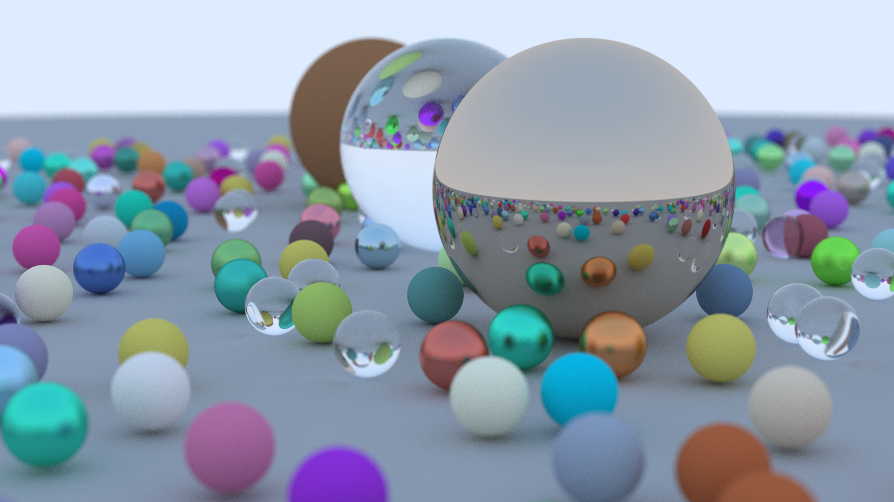
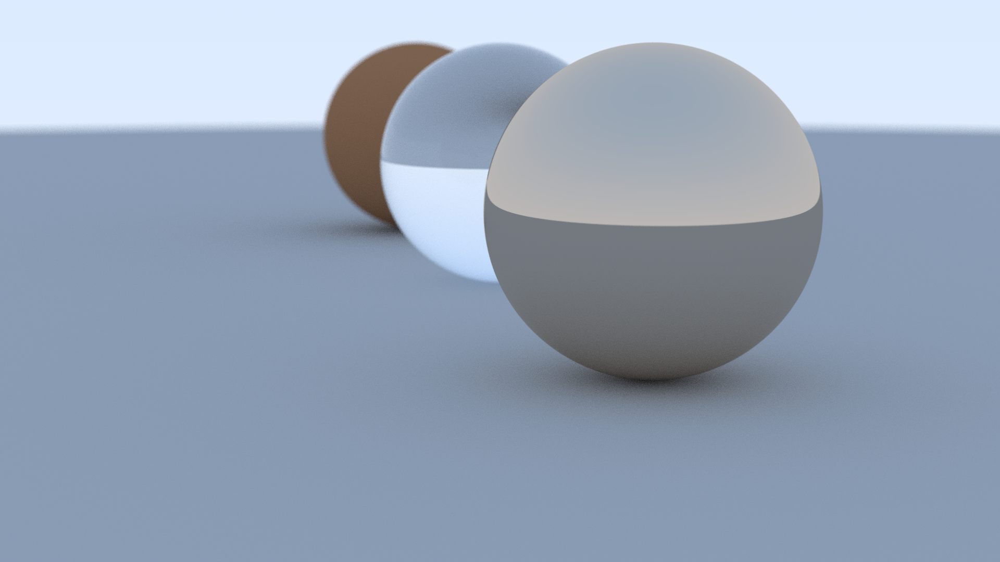
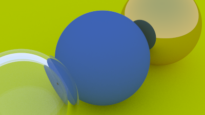

# C++ Raytracer | cpp-raytracer

## Overview
This is a raytracer written in C++ following the Ray tracing in one weekend book. The purpose of thie project is to generate realistic images by simulating shadows, reflection, refraction and many other natural phenomenon. I also wanted to use linear algebra, so I worked on this personal project.

## Homepage
[https://github.com/ananthvk/cpp-raytracer](https://github.com/ananthvk/cpp-raytracer)

## Features
* Shadows, diffuse materials
* Reflections, metals, refractions and glass
* Simple geometric shapes such as spheres
* Anti-aliasing

## Getting started
### Requirements
1. A C++ 11 compiler, (GCC, MSVC, etc)
2. CMake >= 3.10
3. Git (optional)

You can install the packages on linux using your preferred package manager.
For example on ubuntu,
```
sudo apt update
sudo apt install build-essential cmake
```
On windows, install mingw and cmake.

### Building
Get the sources
```
git clone https://github.com/ananthvk/cpp-raytracer.git
```
Otherwise you can also download the source directly from github.
#### Build the project
```
cd cpp-raytracer
mkdir build
cd build
cmake ..
```
#### On linux based systems
```
make
```
Then run the application with
```
./raytracer
```
#### On windows
On windows, open the project in MSVC and build the project.
Run the generated executable.

## Sample renders




## License
This project is licensed under the MIT License - see the [LICENSE](LICENSE) file for details.

## Credits
* `stb_image_write.h` and `stb_image.h` for writing images - [https://github.com/nothings/stb/](https://github.com/nothings/stb/)
* `linalg.h` for vectors -  [https://github.com/sgorsten/linalg](https://github.com/sgorsten/linalg)

## References
[https://raytracing.github.io/books/RayTracingInOneWeekend.html](https://raytracing.github.io/books/RayTracingInOneWeekend.html)
